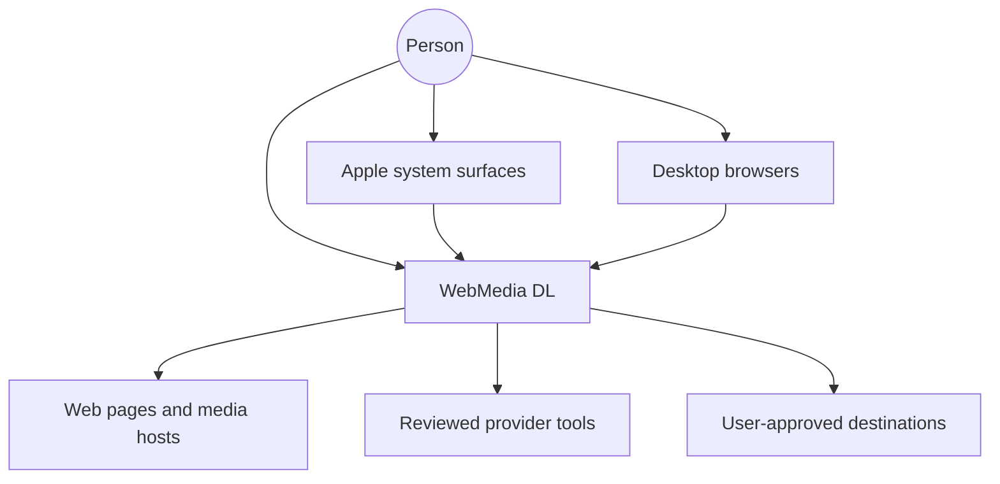
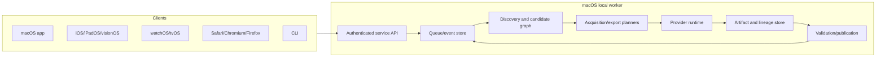

# System architecture

## Context view

## Container view

## Component responsibilities

| Component | Owns | Must not own |
|---|---|---|
| Surface adapters | capture, preview, intent, control | provider commands, policy bypass |
| Intake | typed source validation and normalization | network retrieval |
| Network policy | URL and destination authorization | media semantics |
| Discovery | bounded evidence and candidates | final acquisition decisions |
| Candidate graph | identity, grouping, alternatives, conflicts | file storage |
| Capability registry | provider/platform eligibility and health | user intent |
| Acquisition planner | feasible ranked retrieval strategies | media conversion |
| Provider runtime | deterministic bounded execution | public behavior contracts |
| Artifact store | immutable bytes and lineage references | filename-driven identity |
| Export planner | least-destructive operation DAG | provider-specific flags |
| Processing adapters | execute typed operations | silent semantics changes |
| Validation | prove output contract | subjective quality claims |
| Publisher | contained atomic destination commit | validation exceptions |
| Queue/event store | durable lifecycle and convergence | raw provider console API |
| Cross-device transport | pairing, encrypted messages, replay/expiry | capability policy decisions |

## Invariants

- A source URL never becomes a filesystem path.
- A display title never becomes artifact identity.
- A provider never receives arbitrary user arguments.
- A source artifact is never mutated after registration.
- A derivative never publishes before its mandatory validation passes.
- A worker never executes a capability denied by either the client or worker profile.
- A restricted profile never delegates disallowed work to a more capable worker.
- A browser extension never becomes a generic native command runner.
- A planned or simulated check never becomes runtime PASS.

## Failure containment

Each stage writes only to private staging and durable state. Discovery failures can leave partial evidence; acquisition failures can leave quarantined partial artifacts; one derivative can fail without invalidating other outputs; optional previews can fail independently; publication is the only stage that writes user-visible final paths.

## Scalability boundary

V1 is single-person local-first software. Queue and artifact contracts support many jobs, but no multi-tenant hosted service is implied. Any hosted or remote-worker extension requires a separate threat model and OpenSpec change.
